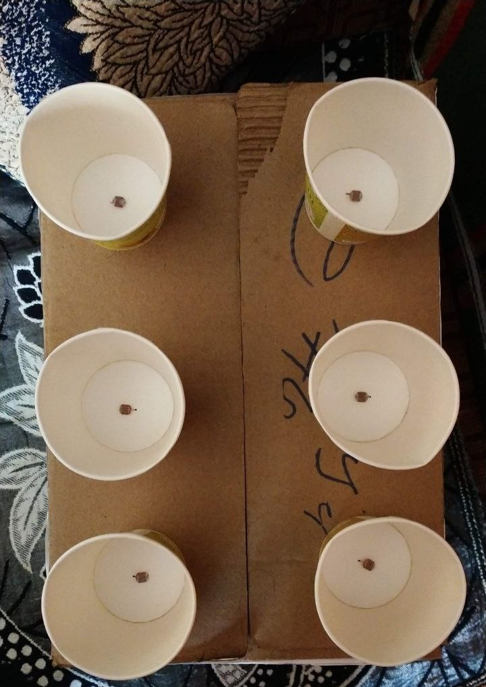
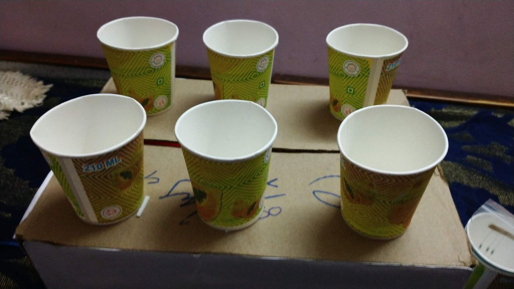
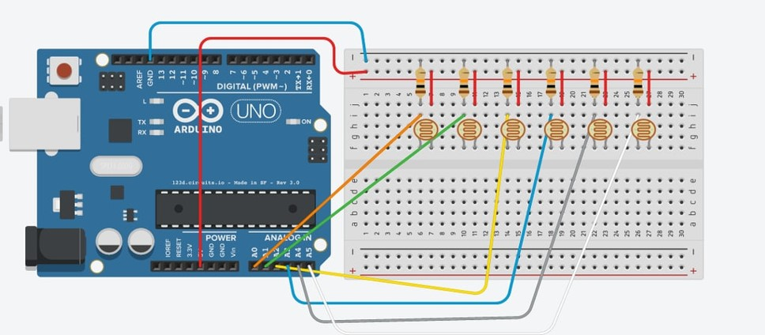
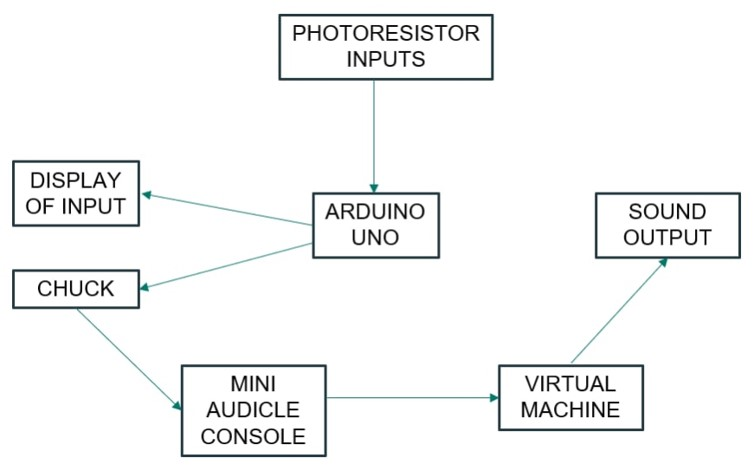
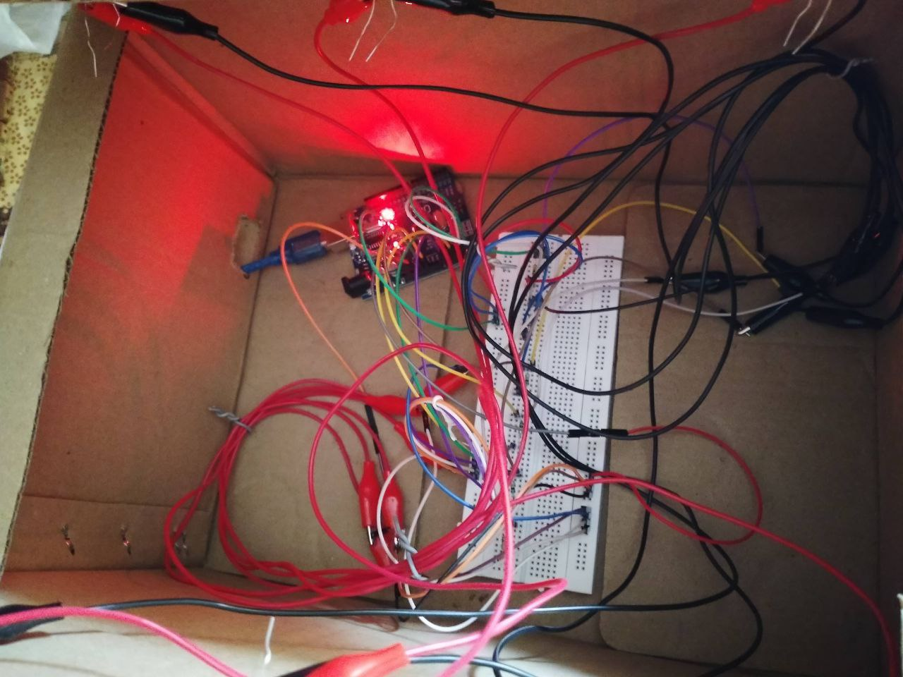

# Luminous Echo

Luminous Echo is an innovative light-based spatial instrument, utilizing Arduino Uno, photoresistors, and the ChucK musical programming language to create a unique IoT musical experience. This project combines sensor technology with musical instrument design, allowing users to interact with sound through light manipulation.

## OVERVIEW

The Luminous Echo consists of six coffee cups, each representing a note of the musical scale. At the bottom of each cup, a photoresistor is installed, wired to an Arduino Uno microcontroller. The primary function of photoresistor is to detect variations in ambient light levels, responding to subtle changes in luminosity with remarkable sensitivity and precision. As light levels fluctuate, the Arduino reads the output from each photoresistor and sends this data to a computer running ChucK, which synthesizes musical notes based on the input.

  

  
  
  

## FEATURES
* Light-based interation: Users can play the Luminous Echo by waving their arms over the cups. The light levels detected by the photoresistors determine the volume and vibrato of the produced sound.
* Arduino Uno Integration: The Arduino Uno serves as the interface between the photoresistors and the computer. It reads the data from the sensors and communicates it to the computer via serial communication.
* ChucK Musical Programming Language: ChucK is used to synthesize musical notes based on the data received from the Arduino. It provides a flexible and intuitive platform for real-time sound generation and manipulation.

## COMPONENTS USED
- Photoresistors – 6
- Arduino UNO – 1
- Breadboard – 1
- Alligator clips – 12
- Connecting wires
- Disposable coffee cups – 6
- Cardboard box – 1
- Laptop - 1

## SOFTWARE USED
* Arduino IDE - [https://www.arduino.cc/en/software](https://www.arduino.cc/en/software)
* ChucK - [https://ChucK.cs.princeton.edu/release/](https://ChucK.cs.princeton.edu/release/)

## SETUP AND CALIBRATION
### (A) Arduino Setup
* To download and set up Arduino Uno on a Windows computer, start by visiting the Arduino website by clicking on the hyperlink mentioned in the above section.
* Download the latest release of the Arduino IDE (as per the configurations of your system). Click the provided link to initiate the download.
* Once the download is complete, double-click the executable (.exe) file to begin the driver installation process. Follow the on-screen instructions in the installation guide.
* In the first step, make sure that you select all the components to install (Arduino software, USB driver, start menu shortcut, associate .ino files).
* Choose the installation directory in the next step. The installation process will extract and install all the required files to execute the Arduino Software properly.
* After the process is completed, you can choose to close the window or select the option 'Run Arduino IDE'. With the Arduino IDE installed, you are ready to start programming your Arduino Uno.
 

### (B) ChucK Setup
* To download and install ChucK on Windows, click on the hyperlink provided in the above section which will redirect you to the official website of ChucK.
* For Windows OS, click on the "installer" hyperlink to download the .msi file. It includes miniAudicle, command-line ChucK, and default chugins library.
* Once the download is complete, execute the .msi file by opening it. Follow the instructions in the setup-wizard to finish the installation process.
* To verify that ChucK is installed correctly on your system, open the Command Prompt, type "chuck" and press Enter. If the installation is successful, you will see a message stating: "[chuck]: no input files ... (try --help)." This confirms that ChucK is properly installed. To check the version of your ChucK software, type the command "chuck --help."
 

### (C) To use the Luminous Echo, follow these steps:
1. Connect the Arduino UNO to the computer via USB.
2. Upload the Arduino sketch and observe the values in the serial monitor.
3. Sound generation is handled by ChucK. Open the program in ChucK IDE (Mini Audicle). Ensure that the correct serial port is specified in the ChucK program (MiniAudicle).
4. Plug in the Luminous Echo via USB and run the program to obtain a list of available serial ports. Select the correct USB port number from the list, enter it in the argument fields, and re-run the ChucK program.
5. Calibrate the setup carefully by changing the values in the code to ensure accurate detection of light levels and optimal sound output.

## USAGE

Wave your hands over the coffee cups to trigger different notes. Experiment with varying light levels to control volume and vibrato. Each cup represents a distinct musical note, offering a diverse range of sound possibilities.

[video](https://github.com/SnPreethi/Luminous_Echo/assets/170320349/f294643a-db98-46d5-93d2-65081dc79d25)

## LAYOUT

<b>Circuit Diagram</b> 

<b>Block Diagram</b>

<b>Internal Connections</b>

## CREDITS

This project was created as a demonstration of the integration of sensor technology and musical instruments as a part of an academic requirement. All the images and videos included in this repository were generated during the development of the project by Preethi Somayajula. This work is inspired from the original creator - <a href="https://github.com/bonniee">bonniee</a>. 

